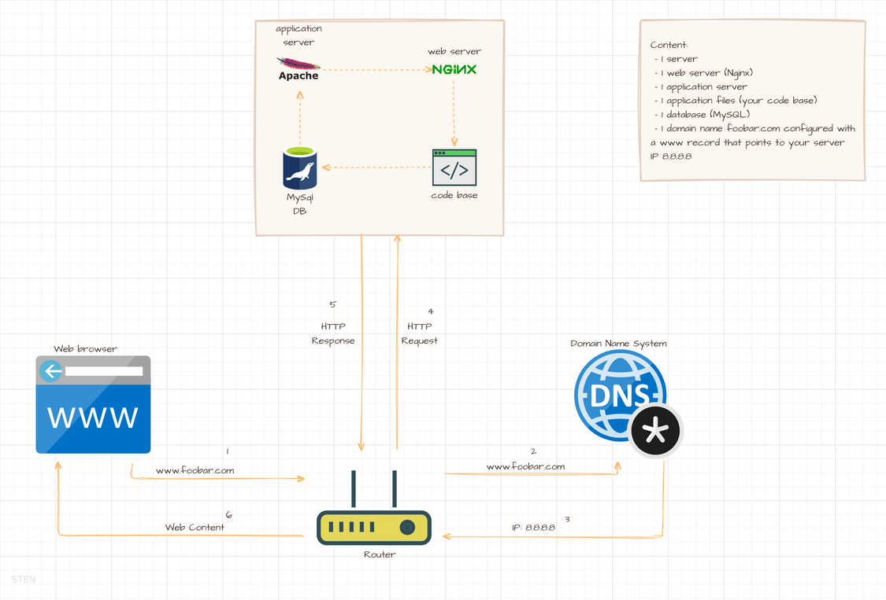
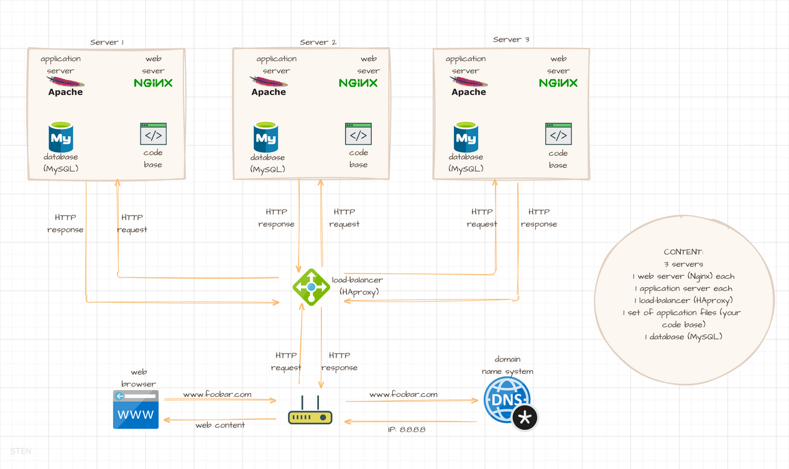
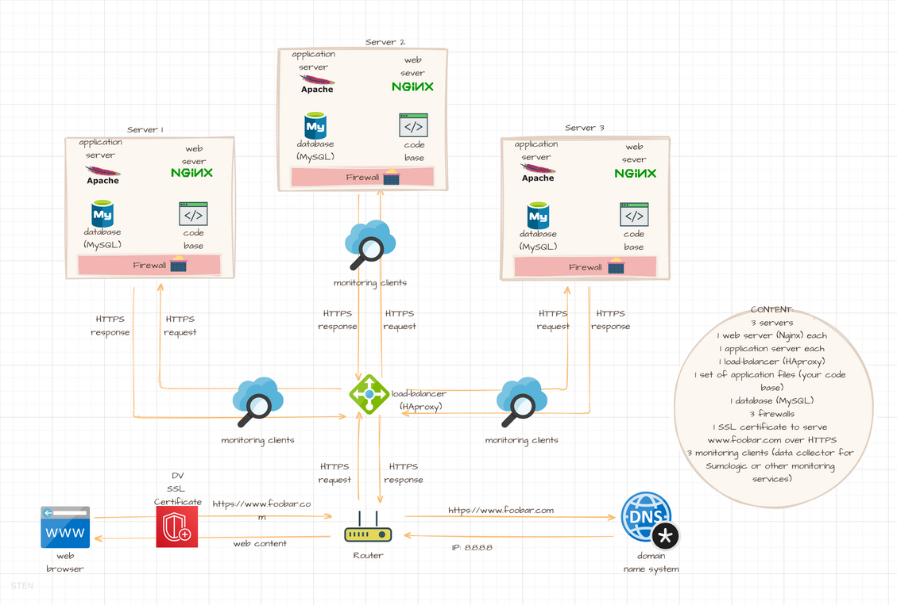
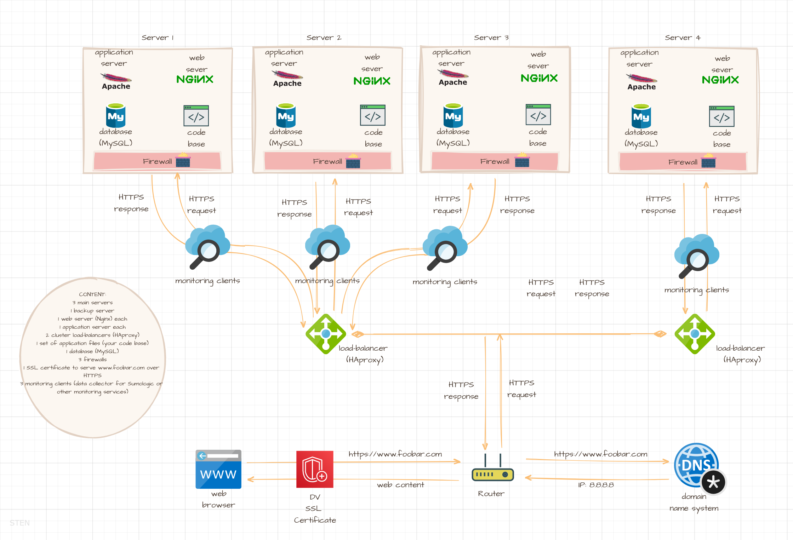

# 0x09-web_infrastructure_design

 

# FAQs:

**What is a server?**

A server is a software or hardware that aids the operation of devices connected to a network.

**Role of DNS:**

DNS is used to allocate domain name to there respective IP address.

**What type of DNS record www is in www.foobar.com?**

The DNS record wwww is of the CNAME record.

**What is the role of the web server?**

The role of the web server is used serve static web contents on http request.

**What is the role of the application server?**

The role of the application server is used serve dynamic web contents on http request.

**What is the role of the database?**

The database is used to store and maintain dynamic web contents.

**What is the server using to communicate with the computer of the user requesting the website?**

The server is communicating with the computer of the user via HTTP request and the response, statically or dynamically.

**SPOF?**

SPOF translate to Single Point of Failure

 

# Infrastructure 101 -- Getting started:
The whole project utilizes the LAMP stack -- Linux, Apache, MySql and Python/PHP

## A Simple web stack

This is a basic infrastructure which contain:

<ul>
    <li>1 server:
        <ul>
            <li>1 web server (Nginx)</li>
            <li>1 application server (Apache)</li>
            <li>1 application files (your code base)</li>
            <li>1 database (MySQL)</li>
        </ul>
    </li>
    <li>1 domain name foobar.com configured with a www record that points to your server IP 8.8.8.8</li>
</ul>

> Simple web stack

 

## A Distributed web infrastructure

This is Distributed web infrastructure(i.e contains more than one server) with features such as:

<ul>
    <li>3 servers
    > each containing:
        <ul>
            <li>1 web server (Nginx)</li>
            <li>1 application server (Apache)</li>
            <li>1 application files (your code base)</li>
            <li>1 load-balancer (HAproxy)</li>
            <li>1 database (MySQL)</li>
        </ul>
    </li>
    <li>1 domain name foobar.com configured with a www record that points to your server IP 8.8.8.8</li>
</ul>

> Distributed web infrastructure

 

## Secured and monitored web infrastructure

This is a Secured and monitored web infrastructure(i.e contains more than one server secured over firewall and monitored) with features such as:

<ul>
    <li>3 servers
    > each containing:
        <ul>
            <li>1 web server (Nginx)</li>
            <li>1 application server (Apache)</li>
            <li>1 application files (your code base)</li>
            <li>1 load-balancer (HAproxy)</li>
            <li>1 database (MySQL)</li>
        </ul>
    </li>
    <li>3 firewalls</li>
    <li>1 SSL certificate to serve www.foobar.com over HTTPS</li>
    <li>3 monitoring clients (data collector for Sumologic or other monitoring services)</li>
    <li>1 domain name foobar.com configured with a www record that points to your server IP 8.8.8.8</li>
</ul>

> Secured and monitored web infrastructure

 

## Scaling up infrastructure

This is a Scaled up infrastructure(i.e contains more than one server secured over firewall, monitored and a backup server for lad balancing) with features such as:

<ul>
    <li>2 server
    > each containing:
        <ul>
            <li>1 web server (Nginx)</li>
            <li>1 application server (Apache)</li>
            <li>1 application files (your code base)</li>
            <li>1 load-balancer (HAproxy)</li>
            <li>1 database (MySQL)</li>
        </ul>
    </li>
    <li>3 firewalls</li>
    <li>1 SSL certificate to serve www.foobar.com over HTTPS</li>
    <li>3 monitoring clients (data collector for Sumologic or other monitoring services)</li>
    <li>1 more server</li>
    <li>1 load-balancer (HAproxy) configured as cluster with the other one</li>
    <li>Split components (web server, application server, database) with their own server</li>
    <li>1 domain name foobar.com configured with a www record that points to your server IP 8.8.8.8</li>
</ul>

> Scaling up infrastructure

 

# Author

[Stephen Nwankwo](https://www.linkedin.com/in/stephen-nwankwo-9876b4196/)

